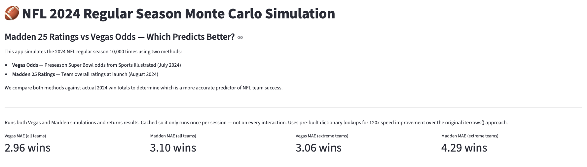
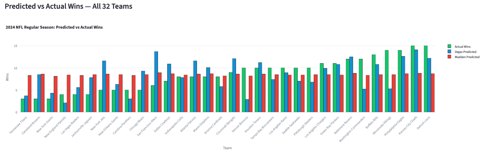

# 🏈 NFL 2024 Regular Season Monte Carlo Simulation
### Madden 25 Ratings vs. Vegas Odds — Which Predicts Better?

[](https://python.org)
[](https://streamlit.io)



## 💡 Motivation

How accurate are Vegas odds at predicting NFL regular season wins? To find out, I needed a unique baseline for comparison — I chose Madden NFL 25 team overall ratings.

I chose to simulate the full regular season rather than just predicting a Super Bowl winner because 272 games across all 32 teams provides a far richer dataset for testing predictive accuracy. The results revealed something more interesting than I expected: the two methods aren't just different in accuracy — they're fundamentally different in purpose, and that difference explains everything.

## 📊 Data

| Source | Data | Date |
|--------|------|------|
| Sports Illustrated | Preseason Super Bowl odds | July 25, 2024 |
| Madden NFL 25 | Team overall ratings | August 2024 launch |
| Pro Football Reference | Actual 2024 win totals | End of season |
| nfl_data_py | 2024 regular season schedule | — |

Finding historically accurate data was the first challenge — Vegas odds and Madden ratings needed to come from the same point in time to make the comparison valid. A Sports Illustrated article from July 2024 aligned perfectly with Madden's August 2024 launch window.

## ⚙️ Technical Challenges

### 1. The iterrows() Bottleneck — 10 Minutes to 5 Seconds
The initial simulation used pandas `iterrows()` to loop through the schedule across 10,000 seasons (2.72 million individual games). This took over 10 minutes to run.

**The fix:** Converting the schedule to a Python list of tuples and mapping team strengths to dictionaries eliminated repeated DataFrame searches. Runtime dropped to under 5 seconds — a **120x performance improvement**.

### 2. The Madden Softmax Problem — The 50/50 Trap
Converting Vegas odds to implied probabilities was straightforward. Converting Madden ratings (75–92 overall) was not.

Softmax normalization was used so all probabilities summed to 1. The flaw: because Madden ratings are so compressed — a maximum spread of just 17 points across all 32 teams — the exponential math treated nearly every matchup as a coin flip. Every team was predicted to finish 8–9 wins regardless of actual quality.

**Proposed improvement:** Applying a temperature parameter to the softmax function or using min-max scaling would create more realistic differentiation, giving a powerhouse like the Chiefs (92 overall) significantly higher win probability against a struggling team like the Giants (75 overall).

### 3. Why MAE Over RMSE
Mean Absolute Error was chosen over Root Mean Squared Error because it expresses prediction error in the same units as the outcome — wins. "The model missed by 2.96 wins on average" is immediately interpretable. RMSE would exponentially penalize injury-driven outlier seasons that neither model could reasonably predict.

## 📈 Key Findings

At first glance, the results were closer than expected:

| Method | MAE (All 32 Teams) | MAE (Extreme Teams Only) |
|--------|-------------------|--------------------------|
| Vegas Odds | 2.96 wins | 3.06 wins |
| Madden 25 | 3.10 wins | 4.29 wins |



The overall gap is small — but misleading. Madden's compressed ratings predicted every team near 8–9 wins, artificially lowering its error on average teams. When filtering to only elite (11+ wins) and bad (6 or fewer wins) teams, the real gap emerged: Vegas outperformed Madden by **1.23 wins per team**.

## 🏈 Notable Outliers

**San Francisco 49ers (Vegas miss):** Predicted 13+ wins, finished 6–11 due to season-ending injuries to Christian McCaffrey, Brandon Aiyuk, and others. No preseason model can price in an injury avalanche of this magnitude.

**Minnesota Vikings (Madden miss):** Rated as thoroughly average, they massively overperformed after rookie JJ McCarthy's injury forced a switch to Sam Darnold, who played elite football under strong coaching.

## 🎯 Conclusion

Purpose dictates performance. Vegas odds exist to make money — sportsbooks employ analysts, advanced metrics, and market-calibrated wisdom specifically to price outcomes accurately. They lose money when they're wrong, creating a direct financial incentive for accuracy.

Madden ratings exist to make a fun, balanced video game. The compression of ratings from 75–92 is a deliberate design choice for gameplay — not prediction. These results support the Efficient Market Hypothesis applied to sports: market-based probability models consistently outperform subjective rating systems when forecasting real-world outcomes.

Neither model accounts for in-season variance. That unpredictability — injuries, breakout performances, coaching changes — remains the largest source of error for both methods.

## 🚀 How to Run

```bash
# Clone the repository
git clone https://github.com/colinmcbane/nfl-monte-carlo-simulation

# Install dependencies
pip install -r requirements.txt

# Run the Streamlit dashboard
streamlit run app.py
```

## 🛠️ Built With

Python · pandas · NumPy · Plotly · Streamlit · nfl_data_py

## 🔮 Future Improvements

- Apply temperature scaling to Madden softmax normalization for more realistic team differentiation
- Add home field advantage factor (~3 point NFL average)
- Simulate playoff bracket based on regular season seeding results
- Weight team strength by position group (QB ratings matter more than kicker ratings)
- Incorporate in-season injury data for dynamic win probability updates

---

*Data sources: Sports Illustrated (July 2024), Madden NFL 25 launch ratings (August 2024), Pro Football Reference, nfl_data_py*